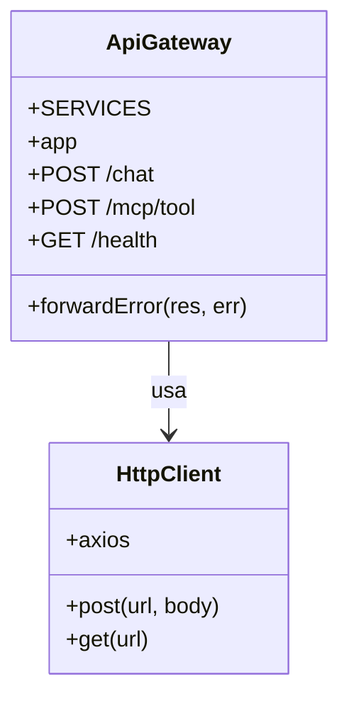

# API Gateway - Diagramas de Classe

## Visão geral

O `api-gateway` é um serviço Node.js/Express que centraliza o roteamento das requisições do cliente para os serviços internos do sistema.

## Componentes principais

- `POST /chat` → envia requisição para `servico-rag`
- `POST /mcp/tool` → envia requisição para `servico-mcp`
- `GET /health` → checa saúde de `servico-rag`, `servico-mcp` e `servico-controlador`
- `forwardError()` → propaga erros de backend para o cliente

## Diagrama de classes

## Estrutura de responsabilidades

- `ApiGateway` é responsável por receber requisições do browser e encaminhá-las para os serviços corretos.
- `HttpClient` representa o uso de `axios` para comunicação HTTP entre microserviços.
- O serviço não mantém modelo de dados persistente: seu papel é proxy/roteamento e monitoramento.
