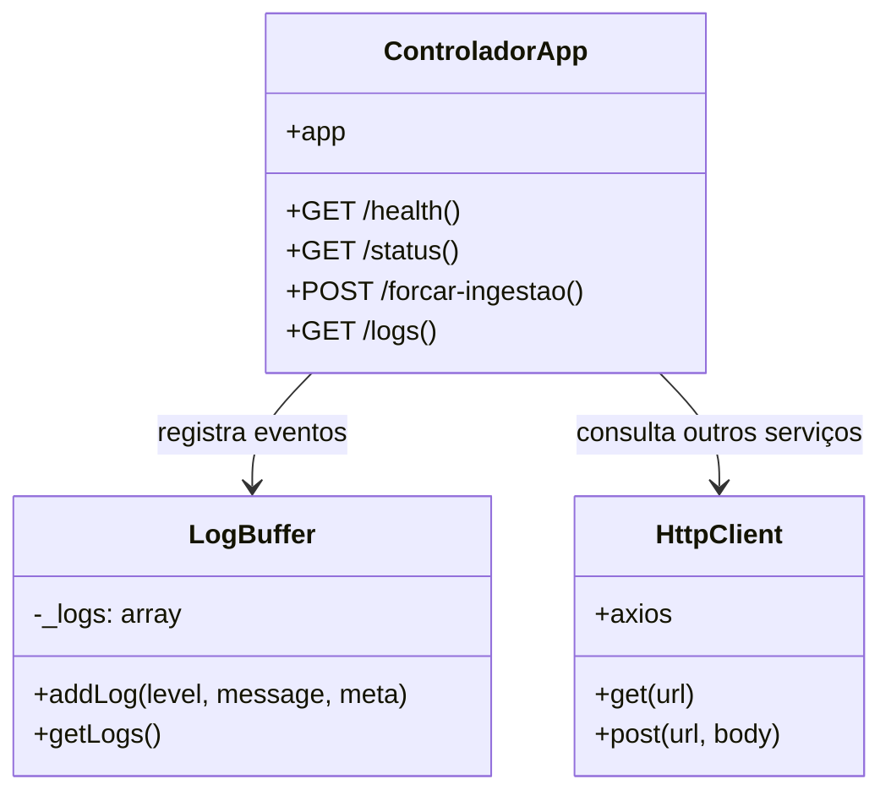

# Serviço Controlador - Diagramas de Classe

## Visão geral

O `servico-controlador` fornece um painel administrativo leve com status do sistema, logs em memória e trigger manual de coleta.

## Componentes principais

- `index.js`
  - `GET /health`
  - `GET /status`
  - `POST /forcar-ingestao`
  - `GET /logs`
- logging em ring buffer
- chamadas HTTP para `api-gateway` e `servico-scrapper`

## Diagrama de classes

## Descrição dos relacionamentos

- `ControladorApp` expõe endpoints para monitorar e acionar o sistema.
- `LogBuffer` mantém as últimas 20 entradas de log em memória.
- `HttpClient` representa o uso de `axios` para consultar `api-gateway` e `servico-scrapper`.
- O serviço não armazena dados persistentes além do buffer de logs.
