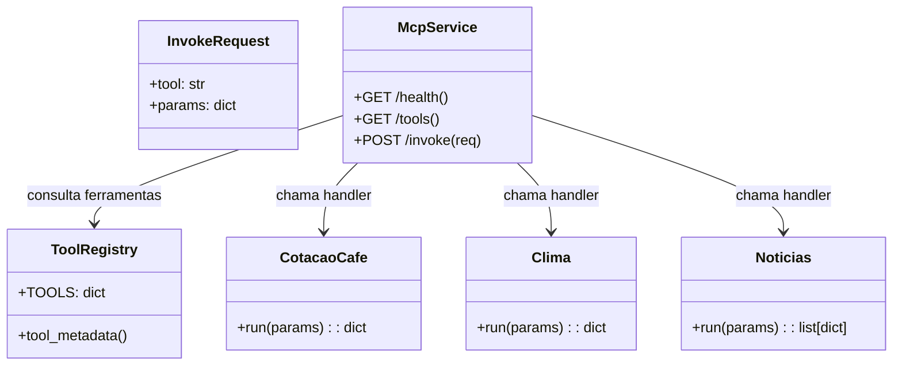

# Serviço MCP - Diagramas de Classe

## Visão geral

O `servico-mcp` oferece ferramentas de domínio para o sistema e expõe:
- `GET /health`
- `GET /tools`
- `POST /invoke`

É responsável por retornar dados simulados de cotação, clima e notícias.

## Componentes principais

- `main.py`
  - `InvokeRequest`
  - `POST /invoke`
- `registry.py`
  - `TOOLS`
  - `tool_metadata()`
- `tools/cotacao_cafe.py`
  - `run(params)`
- `tools/clima.py`
  - `run(params)`
- `tools/noticias.py`
  - `run(params)`

## Diagrama de classes

## Descrição dos relacionamentos

- `InvokeRequest` modela requisições recebidas pelo endpoint `/invoke`.
- `ToolRegistry` mantém o mapeamento de ferramentas e metadados.
- Cada ferramenta (`CotacaoCafe`, `Clima`, `Noticias`) implementa um `run(params)` que retorna o resultado.
- `McpService` delega execução de ferramentas ao `ToolRegistry`.
