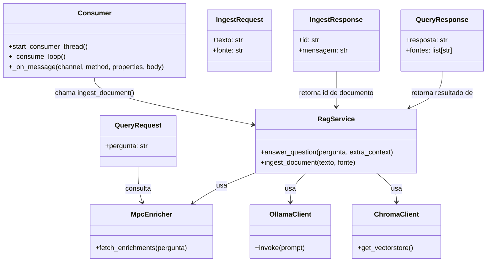

# Serviço RAG - Diagramas de Classe

## Visão geral

O `servico-rag` orquestra consulta de RAG usando:
- LangChain + ChromaDB para busca vetorial
- Ollama para geração de texto
- MCP para enriquecimento de contexto em tempo real
- RabbitMQ para ingestão assíncrona de dados

## Componentes principais

- `main.py`
  - `QueryRequest`
  - `QueryResponse`
  - `IngestRequest`
  - `IngestResponse`
  - `query()`
  - `ingest()`
- `rag.py`
  - `answer_question()`
  - `ingest_document()`
- `mcp_enricher.py`
  - `fetch_enrichments()`
- `consumer.py`
  - `start_consumer_thread()`
  - `_consume_loop()`
- `config.py`
  - variáveis de ambiente e configurações

## Diagrama de classes

## Descrição dos relacionamentos

- `QueryRequest` e `IngestRequest` são os modelos de entrada do FastAPI.
- `QueryResponse` e `IngestResponse` são os modelos de saída.
- `RagService` é o ponto central que chama `ChromaClient` e `OllamaClient`.
- `MpcEnricher` oferece contexto dinâmico que é incorporado ao prompt antes de chamar `OllamaClient`.
- `Consumer` consome mensagens RabbitMQ e chama `RagService.ingest_document()`.
