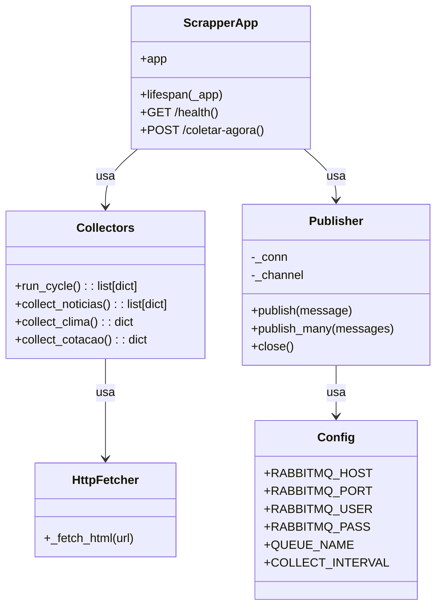

# Serviço Scrapper - Diagramas de Classe

## Visão geral

O `servico-scrapper` é responsável por coletar dados periódicos e publicar mensagens no RabbitMQ.

## Componentes principais

- `main.py`
  - `_collect_loop()`
  - `lifespan()`
  - `GET /health`
  - `POST /coletar-agora`
- `collectors.py`
  - `run_cycle()`
  - `collect_noticias()`
  - `collect_clima()`
  - `collect_cotacao()`
  - fetchers e parsers de sites externos
- `publisher.py`
  - `Publisher`
  - `_ensure_connected()`
  - `publish()`
  - `publish_many()`
- `config.py`
  - variáveis de ambiente

## Diagrama de classes

## Descrição dos relacionamentos

- `ScrapperApp` inicia o loop de coleta e expõe endpoints de saúde e disparo manual.
- `Collectors` produz a lista de mensagens para publicação e implementa parse de sites externos.
- `Publisher` gerencia conexão RabbitMQ e publica mensagens.
- `Config` concentra as variáveis de ambiente utilizadas pelo serviço.
